# XIME

**Xoeris Interactive Modular Ecosystem, Open-Source Android Java Library**

XIME is a modular, Java-only Android library ecosystem authored by Xoeris. Instead of assembling apps from stock Android/AndroidX widgets, XIME provides its own layouts, views, dialogs, motion primitives, haptics, persistence, media, and native tooling, every UI primitive in a XIME-based app (e.g. `xime.ui.layout.LinearLayout`) is a XIME subclass rather than a framework widget. Modules are independently includable Gradle libraries that compose through a strict layered dependency graph.

This is not a small utility library: the tree holds **~1,070 first-party code files (~40,000 lines of Java plus ~250,000 lines of vendored native C/C++)**, including a full music-engine subsystem, a complete terminal stack, a Room-style ORM, a Glide-style image loader, GPU-backed neural-network prebuilts for five ABIs, and vendored filesystem tooling.

> **Status:** Active development. XIME backs production consumer apps (see [Consumers](#consumers)); API surface is stabilizing but may still change between releases.

---

## Table of Contents

- [Background](#background)
- [Module Map](#module-map)
- [Dependency Architecture](#dependency-architecture)
- [Module Architectures](#module-architectures)
- [Featured Subsystems](#featured-subsystems)
- [Tech Stack](#tech-stack)
- [Design References](#design-references)
- [Requirements](#requirements)
- [Getting Started](#getting-started)
- [Third-Party Software & Licenses](#third-party-software--licenses)
- [Consumers](#consumers)
- [Project Status](#project-status)
- [References](#references)
- [License](#license)

---

## Background

Android's recommended app architecture separates apps into UI, domain, and data layers with unidirectional data flow <sup>[1]</sup>. XIME operates one level below that: it is the **UI and infrastructure foundation** those layers are built from. The motivation is consistency and control, a shared design system (custom layouts, glass-morphism widgets, motion curves, haptic language, blur/shader effects) and shared infrastructure (logging, persistence, image loading, background scheduling helpers) reused verbatim across every Xoeris app, instead of reimplemented per project.

Design principles:

- **Replace, don't wrap.** XIME UI components subclass `View`/`ViewGroup` directly; they do not wrap stock widgets.
- **Java only.** All modules are Java 11 with zero Kotlin (Kotlin compilation is `NO-SOURCE` across the tree), keeping the toolchain uniform and the bytecode predictable.
- **Strict layering.** `XIME.Core` is the foundation; feature modules depend downward only (see [Dependency Architecture](#dependency-architecture)). `XIME.AI` is a deliberate exception: a pure-JVM `java-library` module with no Android dependency at all, so the same protocol code runs on Android, plain JVM processes, and Windows.
- **Vendored native code stays visible.** Native dependencies (ncnn, RIFE bridge, erofs/e2fsprogs tooling) live in-tree under `src/main/cpp/third_party/` with per-module `NOTICE` files, so license obligations are auditable (see [Third-Party Software & Licenses](#third-party-software--licenses)).

## Module Map

14 modules, `compileSdk 37`, `minSdk 24`, Java 11. Sizes are first-party files/lines (vendored native excluded):

| Module | Size | Purpose |
|---|---|---|
| `XIME.Core` | 24 Java (~1.9k LOC) + native | Foundational utilities (logging, cache, event bus, dispatch, gesture, theme, repo, system), plus a native RIFE frame-interpolation bridge and prebuilt ncnn/Vulkan binaries for 5 ABIs (~117 MB) |
| `XIME.UI` | 81 Java (~15k LOC), 205 res | Custom layouts (17), views (14), dialogs, menus, adapters, bars, events, drawables, the full design system replacing stock Android components |
| `XIME.Animation` | 7 Java | Motion and transition primitives built on `dynamicanimation` (e.g. `MotionCurve`) |
| `XIME.Haptic` | 10 Java | Haptic feedback abstractions (e.g. `HapticEngine`) |
| `XIME.Graphics` | 4 Java (~2.3k LOC) | GPU shaders: adaptive + legacy blur (`AdaptiveBlur`, `LegacyBlur`), bloom (`SwipeBloom`), dash effects |
| `XIME.Imaging` | 14 Java (~1.3k LOC) | `Prism`: a lightweight, dependency-free Glide-style image loader (memory + disk cache, downsampling, cross-fade, transformations) |
| `XIME.AI` | 11 Java | Pure-JVM client protocol, device registry, and local intent parsing for Hyperion (internal XIME AI subsystem); sole external dep is Gson |
| `XIME.Location` | 2 Java | Location helpers layered on Google Play Services Location |
| `XIME.Net` | 2 Java | Network helpers layered on Play Services Base |
| `XIME.Media` | 56 Java (~11.7k LOC) | Complete music subsystem: playback engine + foreground service, media scanner, playlist/track Room store, 7-band DSP equalizer, lyrics system, spectrum analyzer views, orbit UI, metadata editor, sleep timer, background preloading |
| `XIME.Performance` | 22 Java | 20-class optimization suite plus system-introspection package |
| `XIME.Persistence` | 15 Java | `Peroom`: a Room-style annotation ORM (`@PeEntity`, `@PeDao`, `@PeQuery`, `@PeDatabase`, migrations) with `LiveData` support |
| `XIME.Terminal` | 34 Java (~9.4k LOC) | Full in-app terminal stack: Termux-derived emulator/session/view/text-selection layer plus shell bootstrap, PTY, service, and extra-keys row; BusyBox binary assets (note GPL obligations below) |
| `XIME.Tools` | 11 Java + JNI | Native filesystem tooling over JNI: erofs/ext4 builders and inspectors via vendored erofs-utils v1.9.3 and e2fsprogs v1.47.4 (756 vendored files) |

## Dependency Architecture

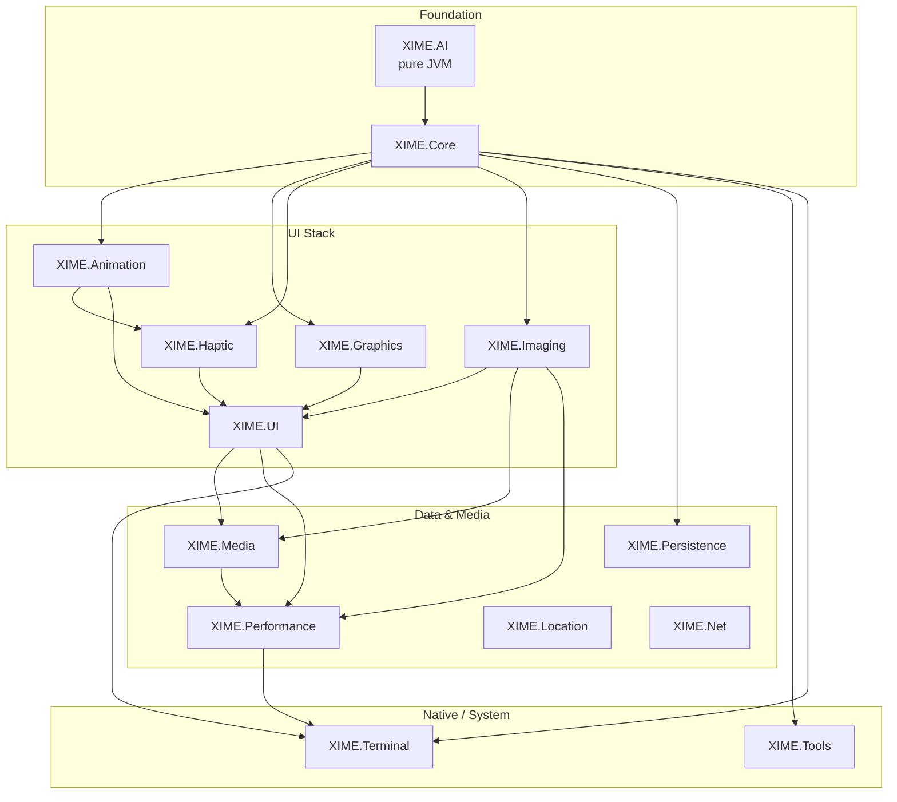

*Figure 1. XIME module dependency graph, derived from each module's `build.gradle`. Arrows point from dependency to dependent. `XIME.Location` and `XIME.Net` are standalone leaves on Play Services.*

## Module Architectures

Class-level maps for every module, derived from the sources. Arrows point from dependency/base toward dependent/subclass.

### XIME.UI, layouts and menus

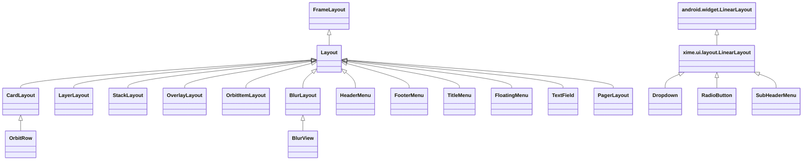

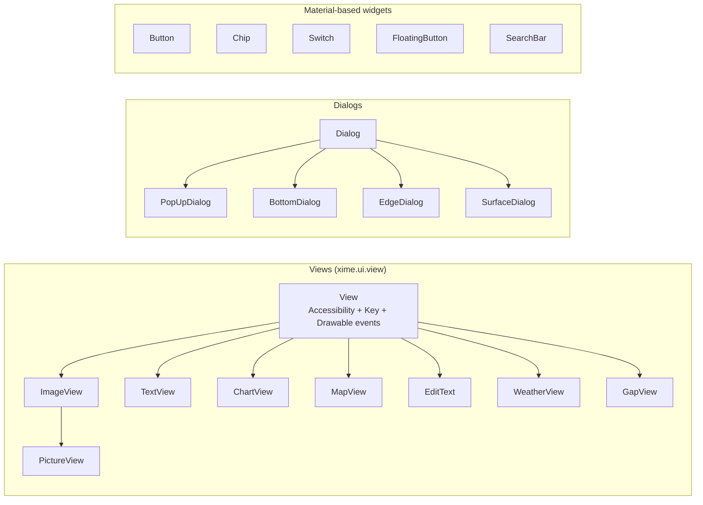

### Glass blur pipeline (XIME.UI + XIME.Graphics)

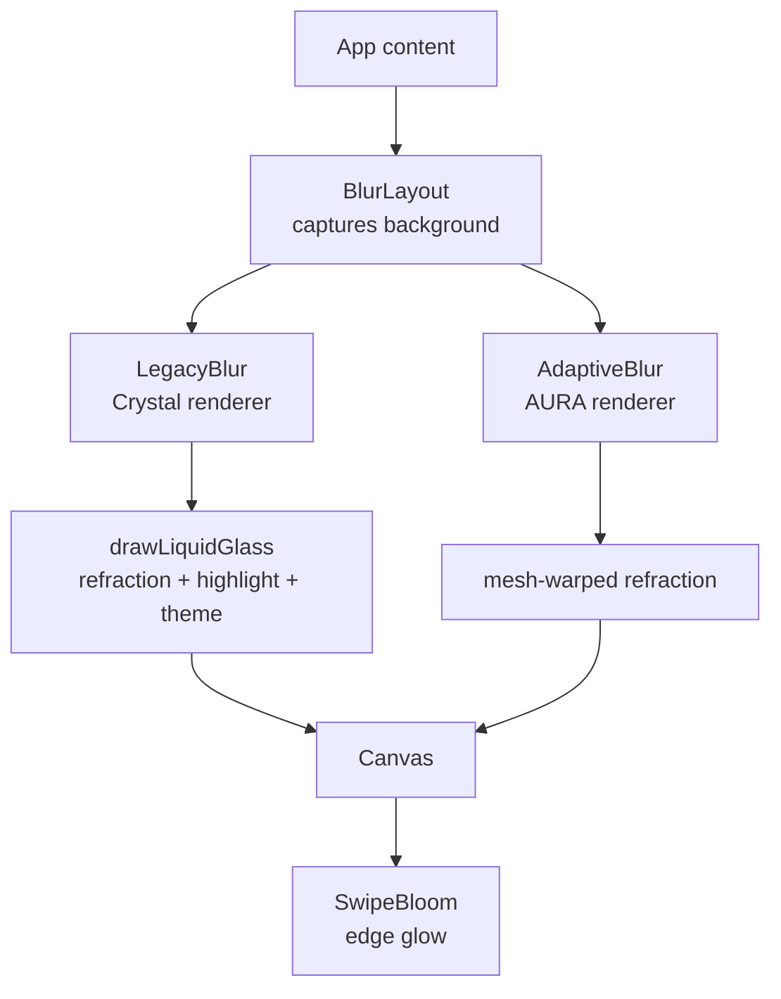

### XIME.Graphics shaders

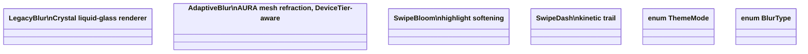

### XIME.Media music subsystem

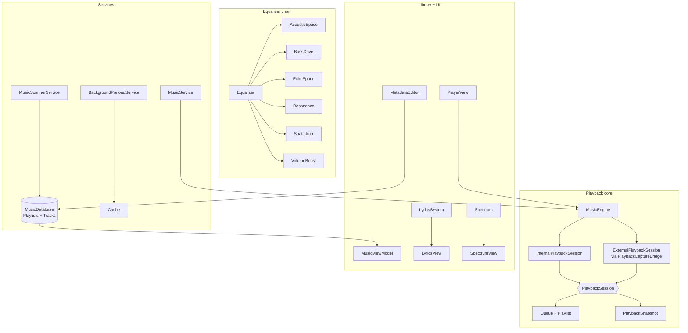

### XIME.Persistence (Peroom ORM)

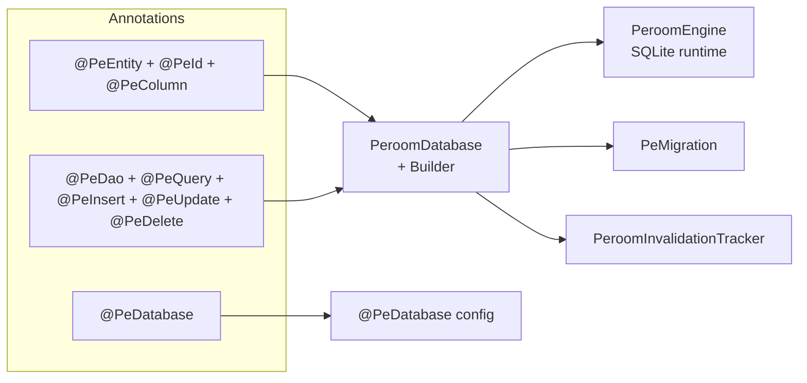

### XIME.Imaging (Prism loader)

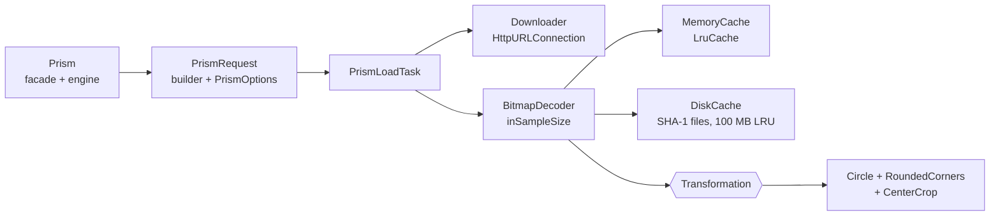

### XIME.Terminal stack

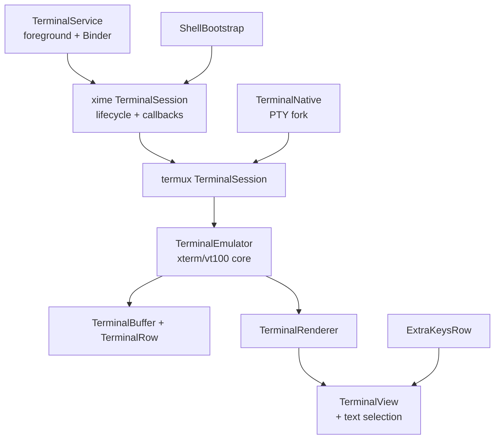

### XIME.AI protocol

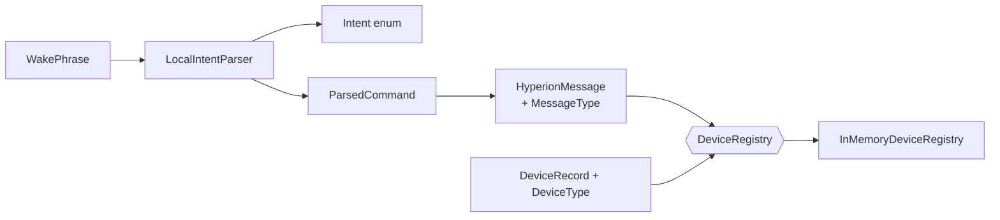

### XIME.Animation

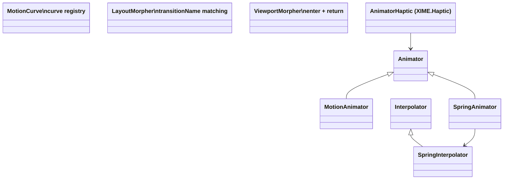

### XIME.Haptic

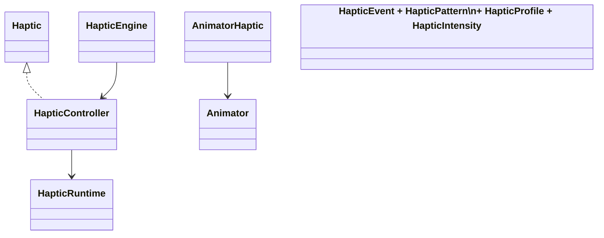

### XIME.Performance Zenith suite

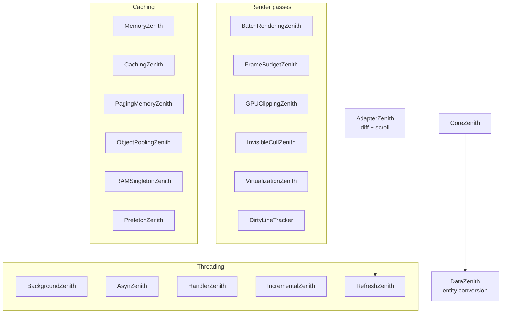

### XIME.Core foundation

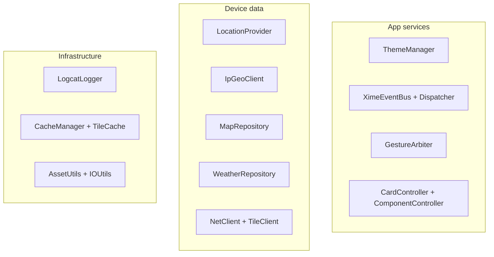

### XIME.Location, XIME.Net, XIME.Tools

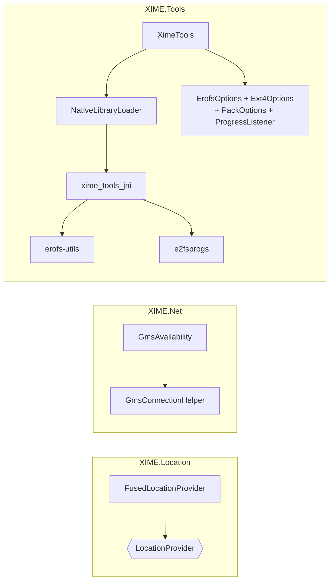

## Featured Subsystems

### Prism (`XIME.Imaging`)

A dependency-free Glide replacement with a chained facade (`Prism.load(url).into(imageView)`): `LruCache` memory cache sized to 1/8 of `maxMemory()`, SHA-1-keyed disk cache under `cacheDir/prism/` capped at 100 MB with LRU eviction, `inSampleSize` downsampled decode against measured view bounds, RecyclerView-safe request tagging (stale results dropped, never flashed), 150 ms cross-fade, and composable transformations, all over plain `HttpURLConnection`.

### Peroom (`XIME.Persistence`)

A Room-style ORM (`xime.persistence.peroom`): `@PeEntity`, `@PeDao`, `@PeQuery`, `@PeInsert`, `@PeUpdate`, `@PeDelete`, `@PeDatabase`, `@PeMigration`, with a `PeroomDatabase` builder, engine, and invalidation tracker, plus `LiveData` query support.

### Hyperion protocol (`XIME.AI`)

A `java-library` module (no Android SDK) implementing the client-side protocol, device registry, and local intent parsing for Hyperion, XIME's internal AI subsystem. Usable from Android apps, plain-JVM agents, and Windows builds; only external dependency is Gson <sup>[5]</sup>.

### Native engine (`XIME.Core`)

`XIME.Core` statically bundles [ncnn](https://github.com/Tencent/ncnn) (BSD 3-Clause) with Vulkan GPU support, prebuilt for `arm64-v8a` (16.6 MB), `armeabi-v7a` (12.7 MB), `riscv64` (28.1 MB), `x86` (27.3 MB), and `x86_64` (32.1 MB), backing a native frame-interpolation engine (`rife_ncnn_bridge.cpp`, `lucine-interpolator.c`) modeled on [rife-ncnn-vulkan](https://github.com/nihui/rife-ncnn-vulkan) (MIT), exposed to Java as `xime.ui.utils.RifeFrameInterpolator`.

### Music subsystem (`XIME.Media`)

A self-contained music app-in-a-library (~11.7k LOC): `MusicEngine` + `MusicService` playback core, `MusicScannerService`, playlist/track Room persistence, a 7-module DSP equalizer (acoustic space, bass drive, echo, resonance, spatializer, volume boost), a lyrics system, spectrum analyzer views, orbit-style player UI, metadata editor, sleep timer, and background preloading.

### Terminal stack (`XIME.Terminal`)

A complete in-app terminal (~9.4k LOC): Termux `terminal-emulator`/`terminal-view` layer <sup>[17]</sup> (`externs.termux`), plus shell bootstrap, PTY natives, a foreground `TerminalService`, and an extra-keys row, with BusyBox binary assets (GPL, see licenses below).

### Shader pack (`XIME.Graphics`)

Four dense GPU-effect classes (~2.3k LOC): `AdaptiveBlur`/`LegacyBlur`, `SwipeBloom`, and `SwipeDash`.

## Tech Stack

- **Language:** Java 11 (100%, no Kotlin)
- **Build:** Gradle 9.4.1 wrapper, Android Gradle Plugin library modules, `compileSdk 37`, `minSdk 24`
- **UI foundation:** AppCompat, Material Components, Navigation, `dynamicanimation`, Palette, SplashScreen <sup>[2][3]</sup>
- **Data:** Room-style Peroom annotations, `LiveData`, Gson <sup>[4][5]</sup>
- **Device services:** Google Play Services Location / Base <sup>[6]</sup>
- **Media:** AndroidX Media
- **Native:** ncnn (BSD 3-Clause), RIFE bridge (MIT-modeled), erofs-utils, e2fsprogs (see licenses below)

## Design References

The visual and interaction language of `XIME.UI` (layout grid, type scale, color roles, motion physics) draws on the following reference material. Each image below is hotlinked from its original source and reproduced under fair use for educational/non-commercial documentation, with full attribution.

### App Architecture


*Layered app architecture: UI layer, optional domain layer, and data layer with unidirectional data flow, the layering XIME's module graph is designed to serve.*
**Source:** Android Developers, [Guide to app architecture](https://developer.android.com/topic/architecture) <sup>[1]</sup>

### Typography Scale


*Default type scale for Material Design 3, Display, Headline, Title, Body, Label, each in Large/Medium/Small, the scale `XIME.UI` text components follow.*
**Source:** Android Developers, [Material Design 3 in Compose](https://developer.android.com/develop/ui/compose/designsystems/material3) <sup>[13]</sup>

### Color Harmony

**Color wheel, primary, secondary, and tertiary roles.** Relevant to `XIME.UI` theming and its drawable/tint system.
**Source:** Interaction Design Foundation, [What is Color Harmony?](https://ixdf.org/literature/topics/color-harmony) · © Interaction Design Foundation, CC BY-SA 4.0 <sup>[14]</sup>

### Responsive Layout Grid

**Responsive columns, gutters, and margins.** The grid logic behind `XIME.UI`'s custom layout containers.
**Source:** Material Design, [Responsive UI](https://m2.material.io/design/layout/responsive-ui.html) <sup>[15]</sup>

### Physics-Based Motion

**Spring and fling animations.** The theory behind `XIME.Animation`'s `MotionCurve` and transition primitives, built on `dynamicanimation`.
**Source:** Android Developers, [Physics-based motion](https://developer.android.com/guide/topics/graphics/physics-based-animation) <sup>[3]</sup>

### Dynamic Color Extraction

**Palette API for extracting prominent colors from images.** Related to `XIME.UI`/`XIME.Imaging` tinting and adaptive visuals.
**Source:** Android Developers, [Palette API](https://developer.android.com/develop/ui/views/graphics/palette-colors) <sup>[3]</sup>

### Iconography

The 166 `xoeris_*` vector drawables in `XIME.UI` are adapted (re-prefixed) glyphs from these icon libraries, all Apache-2.0 licensed:

- **Material Symbols & Icons**, Google Fonts <sup>[18]</sup>
- **Material Design Icons**, Pictogrammers <sup>[19]</sup>
- **Iconify** icon sets (served under each collection's original license; MDI subset is Apache-2.0) <sup>[20]</sup>

**Sources:** [fonts.google.com/icons](https://fonts.google.com/icons) · [pictogrammers.com/library/mdi](https://pictogrammers.com/library/mdi/) · [icon-sets.iconify.design](https://icon-sets.iconify.design/)

### HyperOS Visual Language

Several `XIME.UI`/`XIME.Graphics` behaviors are modeled on the HyperOS (Xiaomi) visual language, as documented and tweaked by the HyperCeiler project <sup>[16]</sup>:

- **Liquid Glass blur.** `LegacyBlur` implements a "Crystal liquid glass blur renderer" (`drawLiquidGlass`), continued by `AdaptiveBlur`'s mesh-warped "AURA" refraction, surfaced through `BlurLayout`, the frosted refractive sheet style of HyperOS system surfaces.
- **Collapsing large title.** `HeaderMenu` implements the collapsing-toolbar pattern (expanded header collapsing to a compact bar with search) seen across HyperOS system apps.
- **Spring motion feel.** `SpringInterpolator` targets the HyperOS motion feel for transitions.

**Source:** ReChronoRain, [HyperCeiler, Make HyperOS Great Again](https://github.com/ReChronoRain/HyperCeiler) (LSPosed module covering HyperOS SystemUI, settings, launcher, and effects) <sup>[16]</sup>

> **Scope note:** HyperOS styling is a visual/behavioral reference only. No HyperCeiler code is vendored in XIME, and none may be: HyperCeiler is AGPL-3.0, which is incompatible with this repository's Apache-2.0 first-party license. XIME's HyperOS-style components are clean-room implementations.

> **Note on image licensing:** Hotlinked images are displayed under fair use for academic documentation. Entries referenced by citation only (color wheel, layout grid) are linked rather than embedded, as their hosts restrict direct embedding. Refer to each source link for the original visual.

## Requirements

- Android Studio (current stable) or command-line Gradle
- JDK 11+
- Android SDK with API 37; `minSdk 24` on consumer apps
- Google / MavenCentral / JitPack repository access (see root `settings.gradle`)

## Getting Started

Add modules à la carte in your app's `settings.gradle`:

```groovy
include ':XIME.UI'
project(':XIME.UI').projectDir = file('<path-to-XIME>/XIME.UI')
```

then depend on them:

```groovy
implementation project(':XIME.UI')   // pulls Core, Animation, Haptic, Graphics (api)
implementation project(':XIME.Persistence')
```

and build with the wrapper:

```bash
./gradlew assembleDebug
```

Start with `XIME.UI` for the design system, add `XIME.Persistence` for storage, `XIME.Imaging` only if you need image loading outside `XIME.UI` (it is already pulled in transitively). Avoid `XIME.Terminal`/`XIME.Tools` unless you accept their GPL-family obligations (below).

## Third-Party Software & Licenses

First-party XIME code is Copyright 2018-2026 Xoeris. Vendored components remain under their own licenses; per-module `NOTICE` files are authoritative where they differ from this summary:

| Component | License | Notes |
|---|---|---|
| Terminal emulation (in `XIME.Terminal`: Termux `terminal-emulator`/`terminal-view` layer, Apache-2.0 exception inside a GPLv3 repo, plus NOTICE-attributed Android Terminal Emulator code, Jack Palevich) | Apache License 2.0 | [termux/termux-app](https://github.com/termux/termux-app) <sup>[17]</sup>; see `XIME.Terminal/NOTICE` |
| BusyBox binary assets (in `XIME.Terminal`) | GNU GPL v2.0 | Copyleft: distributing apps that link `XIME.Terminal` triggers GPL obligations. Source: https://busybox.net <sup>[7]</sup> |
| erofs-utils v1.9.3 (in `XIME.Tools`) | GPL-2.0+ **OR** MIT (dual, per-file); XIME uses the MIT option | Vendored at `XIME.Tools/src/main/cpp/third_party/erofs-utils/`. Source: https://github.com/erofs/erofs-utils <sup>[8]</sup> |
| e2fsprogs v1.47.4 libext2fs (in `XIME.Tools`) | LGPL v2 | Linking into non-GPL works permitted. Source: https://github.com/tytso/e2fsprogs <sup>[9]</sup> |
| e2fsprogs lib/uuid (in `XIME.Tools`) | BSD 3-Clause |, |
| e2fsprogs lib/et com_err (in `XIME.Tools`) | MIT (SIPB) |, |
| e2fsprogs lib/support dict (in `XIME.Tools`) | Kaz Kylheku permissive |, |
| ncnn, prebuilt static libs (in `XIME.Core`) | BSD 3-Clause, © THL A29 / Tencent | https://github.com/Tencent/ncnn <sup>[10]</sup> |
| rife-ncnn-vulkan, design reference for RIFE bridge (in `XIME.Core`) | MIT, © nihui | https://github.com/nihui/rife-ncnn-vulkan <sup>[11]</sup> |
| Gson | Apache License 2.0 | https://github.com/google/gson <sup>[5]</sup> |
| Icon glyphs (`xoeris_*` drawables: Material Symbols, MDI, Iconify collections) | Apache License 2.0 (per collection) | See [Iconography](#iconography) <sup>[18][19][20]</sup> |
| Google Play Services (Location, Base) | Google APIs Terms | https://developers.google.com/android/guides/setup <sup>[6]</sup> |
| AndroidX (Room, LiveData, Media, DynamicAnimation, Palette, Navigation) | Apache License 2.0 | https://developer.android.com/jetpack/androidx <sup>[1][3][4]</sup> |
| Material Components | Apache License 2.0 | https://m2.material.io <sup>[2]</sup> |

> **Practical consequence:** `XIME.Terminal` (BusyBox GPLv2 binaries) is the only module that exports copyleft onto consuming apps. Everything else is permissive or linkable. If your app must stay fully permissive, exclude `XIME.Terminal`.

## Consumers

- **MOVA**, native Android productivity app with on-device mood face recognition; its entire UI layer is built on XIME (`XIME.Core`, `XIME.UI`, `XIME.Animation`, `XIME.Haptic`, `XIME.Graphics`, `XIME.Persistence`). MOVA itself is closed-source; XIME is its open-source foundation.

## Project Status

XIME is under active development alongside its consumer apps. The module set (now 14, recently joined by `XIME.AI`, `XIME.Location`, and `XIME.Net`) and the `Peroom`/`Prism` APIs are stabilizing; expect additive change over breaking change. Issues and pull requests are welcome.

## References

1. Android Developers. (2026). Guide to app architecture. https://developer.android.com/topic/architecture
2. Material Design. Responsive UI / Material Design 3. https://m2.material.io/design/layout/responsive-ui.html
3. Android Developers. Physics-based motion (DynamicAnimation); Palette API. https://developer.android.com/guide/topics/graphics/physics-based-animation
4. Android Developers. Save data in a local database using Room. https://developer.android.com/training/data-storage/room
5. Google. Gson. Apache License 2.0. https://github.com/google/gson
6. Google Developers. Overview of Google Play services / Location. https://developers.google.com/android/guides/setup
7. Andersen, E., Landley, R., Vlasenko, D., et al. (1998–2021). BusyBox. GPL v2.0. https://busybox.net
8. Huawei, Inc., et al. (2018–2024). erofs-utils v1.9.3. GPL-2.0+ OR MIT. https://github.com/erofs/erofs-utils
9. Ts'o, T., et al. (1993–2024). e2fsprogs v1.47.4. Mixed LGPL v2 / MIT / BSD. https://github.com/tytso/e2fsprogs
10. THL A29 / Tencent. (2017–). ncnn. BSD 3-Clause. https://github.com/Tencent/ncnn
11. nihui. (2020–). rife-ncnn-vulkan. MIT. https://github.com/nihui/rife-ncnn-vulkan
12. Palevich, J. (2007–2011). Android Terminal Emulator. Apache License 2.0.
13. Android Developers. Material Design 3 in Compose (type scale). https://developer.android.com/develop/ui/compose/designsystems/material3
14. Interaction Design Foundation. What is Color Harmony? https://ixdf.org/literature/topics/color-harmony
15. Material Design. Responsive UI (layout grid). https://m2.material.io/design/layout/responsive-ui.html
16. ReChronoRain. HyperCeiler, Make HyperOS Great Again (HyperOS SystemUI/settings/launcher effects reference; LSPosed module, AGPL-3.0). https://github.com/ReChronoRain/HyperCeiler
17. Termux. terminal-emulator / terminal-view libraries (Apache-2.0 exception inside the GPLv3 termux-app repo; the layer XIME.Terminal vendors). https://github.com/termux/termux-app
18. Google. Material Symbols & Icons. Apache License 2.0. https://fonts.google.com/icons
19. Pictogrammers. Material Design Icons. Apache License 2.0. https://pictogrammers.com/library/mdi/
20. Iconify. Icon sets (per-collection licenses). https://icon-sets.iconify.design/

## License

XIME first-party code is **open source under the Apache License 2.0** (© 2018-2026 Xoeris), see [LICENSE.md](LICENSE.md), which also documents the scope exclusions. Third-party and vendored components remain subject to their respective licenses as listed in [Third-Party Software & Licenses](#third-party-software--licenses) and the per-module `NOTICE` files (`XIME.Terminal/NOTICE`, `XIME.Tools/NOTICE`), which are authoritative in case of discrepancy. In short: everything is permissive **except `XIME.Terminal`** (BusyBox GPLv2), exclude that module if your app must stay closed-source.
